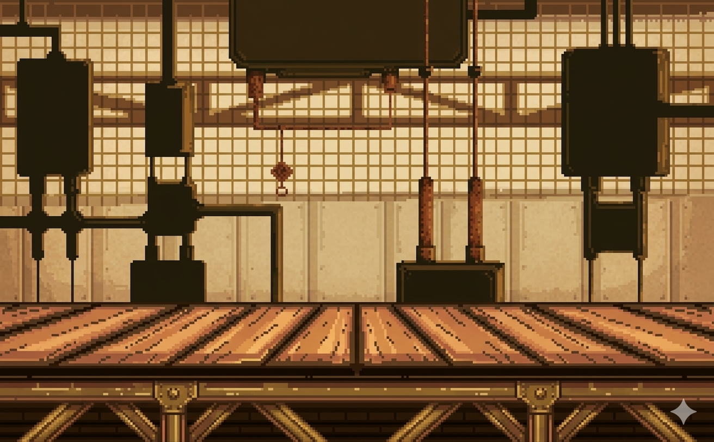

# Kapitola 3: Grafika a Vizuální tvorba

Grafický směr hry ScrapScrap je laděn do pixel-artového steampunkového/industriálního stylu s využitím teplých barevných tónů (mosaz, bronz, měď) kontrastujících s šedomodrými prvky starého kovu.

## Tvorba pozadí (Background)
Jako hlavní pozadí hry slouží obrázek `factory.png`. 
Tento obrázek reprezentuje detailní interiér továrny s potrubím, parními ventily a konstrukcemi. Pro docílení požadované palety a atmosféry byly původní referenční koncepty upraveny a barevně sjednoceny, aby pozadí nerušilo herní prvky (plošiny), ale zároveň dodalo hře hloubku.

*(Ukázka: factory.png - Pozadí herního světa)*

## Herní objekty a Sprite animace
**Hlavní postava (Robot):**
Animace pohybu hlavního hrdiny je řešena sekvencí pěti samostatných snímků (`run1.png` až `run5.png`). Tento "sprite sheet" přístup se cyklí na základě uplynulého času (`animTimer`), když se hráč pohybuje po pevném povrchu.

**Dynamické vykreslování v Canvasu:**
Z důvodu optimalizace a bezchybného vykreslování přes pozadí na všech prohlížečích jsme upustili od načítání externích textur pro plošiny. Místo toho jsme vyvinuli programové renderování (Hard-coded drawing v HTML5 Canvas):
- **Plošiny:** Pomocí obdélníků (`fillRect`) kreslíme mosazný základ, kterému přidáváme světlé a tmavé hrany pro 3D efekt. V rozích jsou pomocí `arc` dokreslovány ozdobné nýty.
- **Ozubená kola:** Rotující prvky jsou tvořeny složitější sekvencí Canvas operací – nakreslí se středový kruh, následně se ve smyčce (s rotací souřadnicového systému) vykreslí 12 obdélníkových "zubů" kola a nakonec je překryje středová díra. Výsledkem je ostře a čistě vykreslené ozubené kolo, které se plynule otáčí v závislosti na svém parametru `speed`.

## Tvorba Menu
Menu pozadí (`menu.png`) bylo koncipováno tak, aby uvedlo hráče do světa ještě před stisknutím tlačítka Play. Samotné UI (tlačítka jako Play, Credits, Restart) není statický obrázek, ale je interaktivně vykreslováno přes Canvas – reaguje na pozici kurzoru myši změnou barvy (Mosazná -> Zlatavá).
